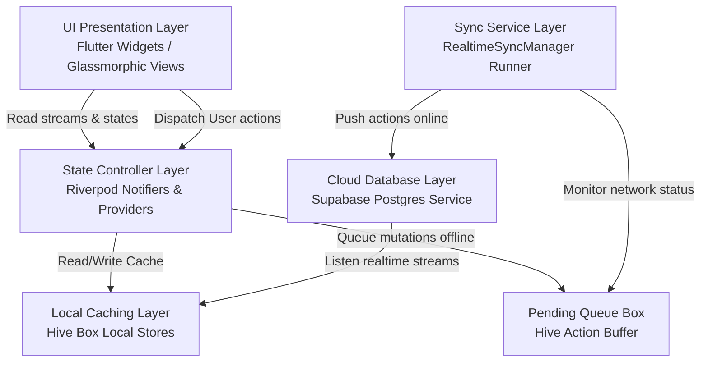
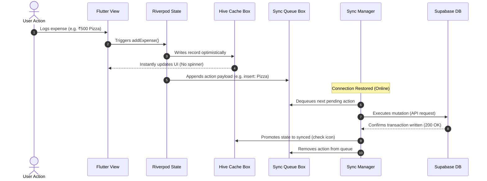

# Kanakku: Shared Group Expense & Personal Finance Tracker

**Kanakku** (meaning *Account* or *Calculation* in Tamil/Malayalam) is a high-performance, offline-first Flutter application designed for shared group expense management and personal finance tracking. Tailored specifically for Indian users, the application features native **₹ (INR) currency support**, **multi-currency conversion**, and default **UPI** payment workflow integration.

The application leverages a dark glassmorphic UI design, combining visually stunning aesthetics with a robust offline sync architecture powered by **Riverpod**, **Hive**, and **Supabase**.

---

## 🚀 Key Features

### 1. Shared Group Ledgers (`/groups`)
*   **Create or Join Groups**: Instantly create groups or join existing ones using a unique 6-character invite code.
*   **Group Expenses & Splits**: Log shared transactions with split types:
    *   `equal`: Splits the amount equally among all group members.
    *   `custom`: Splits the amount using custom-defined balances per member.
*   **Settlements**: Record settlements directly within the group to clear balances.
*   **Group Chat**: Reconciled real-time chat with other group members.

### 2. Personal Finance Ledger (`/dashboard`)
*   **Income & Expense Management**: Track personal expenses and income categories.
*   **Dynamic Custom Categories**: Add custom categories on-the-fly inside the category selection bar. Previously created custom categories are loaded dynamically as chips for instant one-tap reuse.
*   **Custom Income Sources**: Input arbitrary source names when logging income. Previously used custom sources are automatically pre-populated as chips.
*   **Payment Method Tracking**: Accurately classify personal expenses under payment methods (UPI, Cash, Card, Bank Transfer, or Other).
*   **Smart Auto-Replication**: Group expenses paid by the current user are replicated automatically into their personal transaction history.

### 3. Financial Intelligence Center 2.0 (`/insights`)
*   **Personal Financial Advisor**: A gorgeous, interactive panel interpreting your financial data in real time.
*   **Financial Health Score**: Dynamic indicator score (10–100) computed based on savings rates, category budget overruns, and financial runway metrics.
*   **Spending Pattern Detectors**: Advanced pattern analysis highlighting late-night spending spikes or weekend spending patterns.
*   **Runway & Goal Forecast Engine**: Machine-learning style forecasting of monthly runaways, future expenses, and savings goal completion dates.
*   **Gamified Lifstyle Personas**: Classifies spending behavior into animated card personas (e.g., *Sovereign Saver*, *Vibrant Voyager*).
*   **Milestones & Achievements**: Unlocks trophies and challenges (e.g., *Debt Buster*, *Budget Boss*) based on savings behavior.

### 4. Security & Preferences (`/settings`)
*   **App Lock**: Secure the app database with a 4-digit PIN passcode.
*   **Change Passcode**: Dynamically verify current PIN and update it within security settings.
*   **Local Cache & Sync**: Optimistic local state rendering with background synchronization.
*   **Export/Import Data**: Safe export and import of personal configuration databases as JSON files (instantaneous local operations, removing visual blocking overlay dialogs to ensure seamless execution).
*   **Clean Core Settings**: Streamlined configuration page focused strictly on preference and security controls.

---

## 🛠 Architecture & Tech Stack

Kanakku uses a multi-layered, **offline-first Architecture** combining **Flutter UI**, **Riverpod State controllers**, **Hive local caching**, and the **Supabase cloud engine**.



### 1. Architectural Layers & Roles
- **Presentation Layer (`lib/shared` & `lib/features/*/presentation`)**: Renders the visual elements, charts, and transaction feeds. Listens directly to Riverpod StreamProviders.
- **State Controller Layer (`lib/core/providers` & `lib/features/*/data`)**: Riverpod Notifiers maintain in-memory states (theme index, currencies, wallet balances, budgets) and dispatch database actions.
- **Local Persistence Layer (`lib/core/database/local_cache_service.dart`)**: Uses Hive to cache list/map representations of tables. Enables zero-latency startup and complete offline usability.
- **Background Sync Layer (`lib/core/database/realtime_sync_manager.dart`)**: A connectivity-aware worker that monitors the network status and serializes pending local writes to the cloud DB.
- **Cloud Database Layer (Supabase)**: Serves as the source of truth, enforcing cascading schema relationships and Row-Level Security (RLS) policies.

---

## 🔄 Caching & Offline Sync Pipeline

Kanakku implements a strict **Optimistic Update** model. Below is the step-by-step transaction sync lifecycle:



### Flow Details
1. **Offline Write**: Transactions logged while offline update the local Hive cache immediately, creating a temporary ID (e.g. `temp_1700000000`).
2. **Queueing**: The mutation is saved as a JSON packet inside `kanakku_pending_queue_v4` describing the `actionType` (`insert`, `update`, `delete`), table `path`, and parameters.
3. **Reconciliation**: When connection status changes to online, `RealtimeSyncManager` executes the action queue sequentially. On success, it replaces temporary cached IDs with the confirmed Supabase database row.

---

## 📂 Codebase Directory Layout

The codebase adheres to a clean, **feature-first directory layout**:

```
lib/
├── core/
│   ├── constants/       # App durations and configuration limits
│   ├── database/        # Hive cache, chat engine, sync manager, and Supabase client
│   ├── exceptions/      # Core exception handling schemas
│   ├── logging/         # Internal system logger
│   ├── providers/       # Riverpod Providers (preferences, auth status, session lock)
│   ├── routes/          # GoRouter routing declarations
│   ├── theme/           # App colors and typography
│   └── utils/           # Multi-currency helper and validators
├── features/            # Isolated business-logic modules
│   ├── auth/            # Splash, login, signup, and passcode verification UI
│   ├── budget/          # Personal budget settings and category limit screen
│   ├── dashboard/       # Core dashboard home screen
│   ├── expenses/        # Personal transaction logic and entries
│   ├── groups/          # Group lists, settings, detail screens, splits, and service APIs
│   ├── income/          # Income source entries and trackers
│   ├── insights/        # Smart health score, graphs, and wrap analytics
│   ├── profile/         # Profile details and display setups
│   └── settings/        # App controls, backups, guides, and UPI links
└── shared/              # Reusable UI widgets (GlassCard, CustomTextField, BottomNav)
```

---

## 🔧 Installation & Setup

### Prerequisites
- Flutter SDK (v3.19+ recommended)
- Dart SDK
- Android SDK (for mobile builds)

### 1. Clone the Repository
```bash
git clone https://github.com/<your-username>/kanakku_flutter.git
cd kanakku_flutter
```

### 2. Install Dependencies
```bash
flutter pub get
```

### 3. Setup Environment Variables
Create a `.env` file in the root directory:
```env
SUPABASE_URL=https://your-supabase-url.supabase.co
SUPABASE_ANON_KEY=your-supabase-anon-key
```

### 4. Running the Project
```bash
# Run in development mode
flutter run

# Run static analysis
flutter analyze

# Run tests
flutter test
```

---

## 📱 Emulator Stability Guidelines (Windows)
To prevent graphics driver crashes or debugger disconnects inside the Android Emulator on Windows:
1. **Disable Impeller Rendering**: Impeller is disabled by default in `AndroidManifest.xml` via:
   ```xml
   <meta-data
       android:name="io.flutter.embedding.android.EnableImpeller"
       android:value="false" />
   ```
2. **Graphics Configuration**: Set graphics rendering in the AVD Manager to `Software - GLES 2.0` if you experience GPU-related freezes.
3. **Emulator Images**: Use stable system images (**API 34** or **API 35**).
